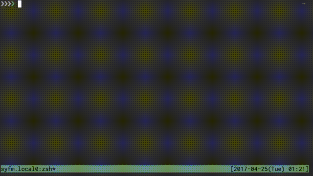

# Sub-Alias
[](https://app.wercker.com/project/byKey/33e127b80f4ea96bc02dc4bfac4dbdac)  
Apply alias to sub-commands

  

## Description  
I don't like longer commands. So I often use `alias`.  
Just like following:  
``` sh
$ alias d=docker
$ d ps
# `docker ps`
```

Infrequently, we want to use `alias` to sub-command.  
However, `alias` command can apply for command only.  

`salias` means sub-alias. `salias` makes it possible to apply alias to sub-commands.  

## Example
~/salias.toml
``` toml 
[go]
i = "install"
b = "build"
r = "run"

[docker]
i = "image"
c = "container"

[docker-compose]
l = "logs -f"
```

``` bash
$ go i github.com/golang/go
# `go install github.com/golang/go` 

$ docker i ls
# `docker image ls`

$ alias d=docker
$ d c ls
# `docker container ls`
```

## Equipments
- Go v1.8 or newer
- bash or zsh

## Installation
``` sh
$ go get github.com/lycoris0731/salias
```

## Usage
### Set sub-alias definition file
Please set the file to one of following.  
- $SALIAS_PATH
- $XDG_CONFIG_HOME/salias/salias.toml
- $HOME/salias.toml

Add following command to `.bashrc` or `.zshrc`.  
``` sh
source <(salias __init__)
```

## License
Please see [LICENSE](./LICENSE).
